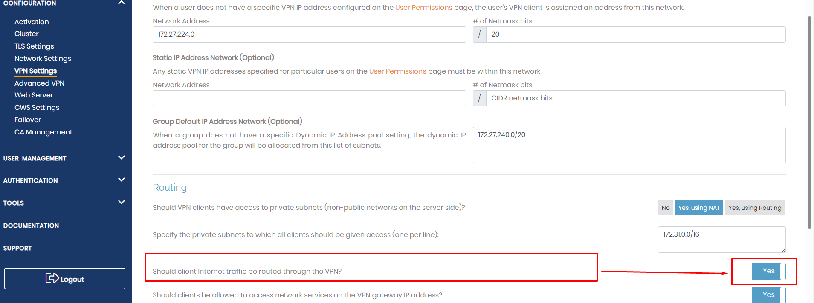
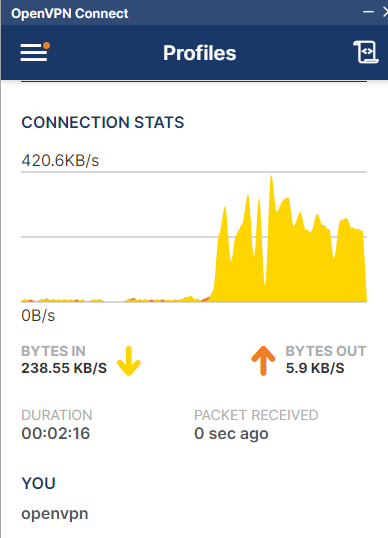

# Project: Create and Connect to a free VPN server on AWS with Terraform

This project help you launch your own Open VPN server on AWS

## Overview

### Introduction

- Tech stack: `AWS`, `terraform`, `VPN`

### Prerequisite

- An AWS account
- AWS CLI installed
- Terraform installed

## 1-Overview

## 2-Prerequisite

### 2.1-Sign up for an AWS account

- Follow https://docs.aws.amazon.com/AWSEC2/latest/WindowsGuide/get-set-up-for-amazon-ec2.html#sign-up-for-aws

### 2.2-Create a key pair

- Follow https://docs.aws.amazon.com/AWSEC2/latest/WindowsGuide/get-set-up-for-amazon-ec2.html#create-a-key-pair
- Note the key-pair name that you created for later use. E.g: `my-new-keypair-for-demo`
- The private key file is automatically downloaded by your browser. The base file name is the name you specified as the name of your key pair, and the file name extension is determined by the file format you chose. Save the private key file in a safe place.

### 2.3-Configure Terraform environment to work with AWS

- Check this `Prerequisites` section: https://developer.hashicorp.com/terraform/tutorials/aws-get-started/aws-build#prerequisites

## 3-Launch the new Windows instance

### 3.1-Navigate to the current project

- Ensure you are in the terraform-aws-windows-instance project.
- If not, run `cd terraform-aws-windows-instance`

### 3.2-Update your own credentials/data in `terraform.tfvars`

- Create file `terraform.tfvars`, by running command: `cp terraform.tfvars.sample terraform.tfvars`

#### _Public-IP_

- Then add your public ID here (to allow RDP access from your PC).
  _Tips_: Visit https://www.whatismyip.com/ to get your public IP

#### _Keypair name_

- Provide the keypair name you created in the step `Create a key pair` above

### 3.3-Terraform init

- Run `terraform init`

### 3.4-Terraform plan

- Run `terraform plan`

### 3.5-Terraform apply

- Run `terraform apply`, then check the plan, and type `yes` to confirm!

## 4-Connect to the VPN

### SSH to the instance to get password

- Avoid permission issue `chmod 400 your_key.pem`
- Run `ssh -i "<your-key-pair>" openvpnas@your_instance_public_DNS_or_IP`
- Then `sudo passwd openvpn` to setup your new password

### Configuring the VPN server

Visit: http://your_instance_public_DNS_or_IP:943/admin
Login with:

- User: `openvpn`
- Password: `your_own_pass_created_above`

### Result

